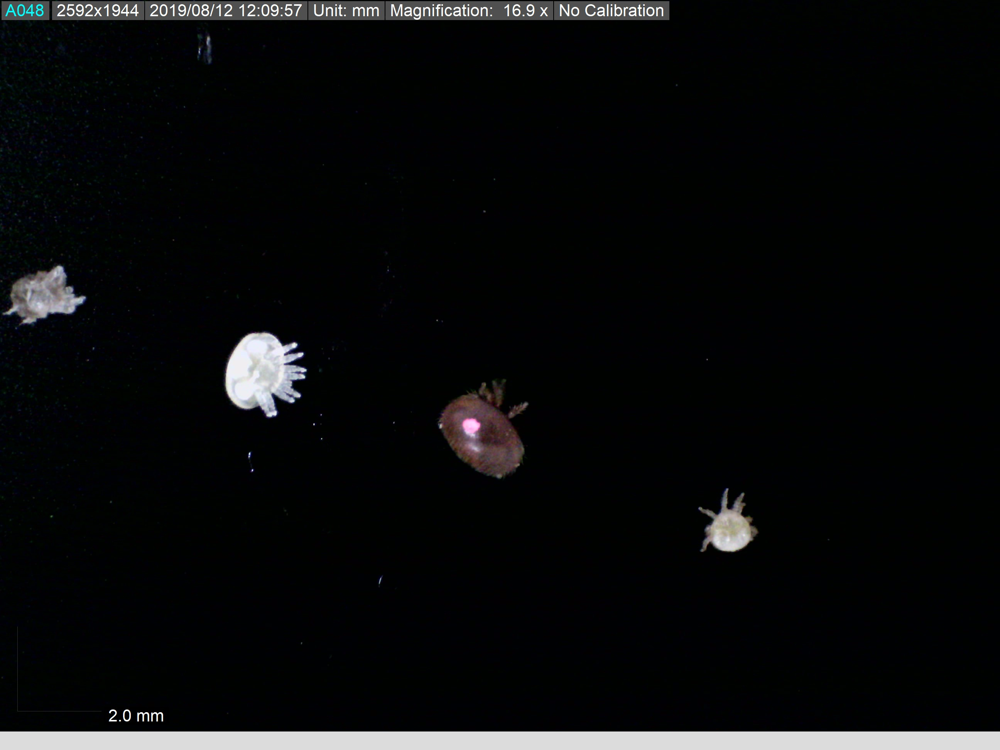

# Varroa-linkage-map

This project aims to construct a linkage map of <i>Varroa destructor</i> genome.
We used genomes of 223 varroa mite samples, belonging to 30 families, obtained from 3 honey bee colonies (<i> Apis mellifera</i> ).
Each mite family consists of 3 generations, and contain at least:
- foundress female mite
- son and daughter
- at least one grandchild (male/female)

Small family of mites, from left to right: daughter's molt, daughter (imobile), foundress mother (marked in pink), and the son. 

All mites were collected at the experimental apiary of OIST (Okinawa Institute of Science and Technology), between July and October 2020. For detailed description, please see the Method section in the paper.  

## Available data
### Varroa genome sequences 
The repository contains all that is required for you to re-run the analysis.
However, the original input fastaq files and reference genome are too large to be uploaded to the Github repository, therfore, prior to runing the pipline you need to download them to your cluster/computer. 
1. Varroa reference genome, [GCF_002443255.1 Vdes_3.0](https://www.ncbi.nlm.nih.gov/genome/?term=txid109461%5Borgn%5D), by [Techer et al. 2000](https://www.nature.com/articles/s42003-019-0606-0).
2. Varroa families whole-genome sequences, raw fastq reads [BioProject___](__link to the NCBI with fastq files_)

### Codes
1. Genomics analysis workflow from raw reads (fastg.gz files) down to the VCF is summarized into a Snakemake pipeline. The pipeline steps are available in the `Snakefile` file, along with parameters file `cluster.json` and launcher `snakemake.slurm`. The final VFC output is later used as input for the linkage map.
2. All scripts called in `Snakefile` are present in the `scripts` folder.
3. R markdown can be found in `R_data` folder.
