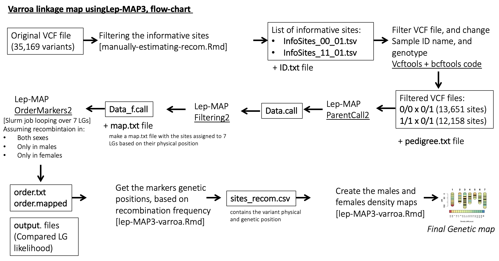

# Estimating recombination frequency of Varroa using Lep-MAP3

This project aims to construct a linkage map of <i>Varroa destructor</i> genome.
We used genomes of 223 varroa mite samples, belonging to 30 families, obtained from 3 honey bee colonies (<i> Apis mellifera</i> ).
Each mite family consists of 3 generations, and contain at least:
- foundress female mite
- son and daughter
- at least one grandchild (male/female)

All mites were collected at the experimental apiary of OIST (Okinawa Institute of Science and Technology), between July and October 2020. For detailed description, please see the Method section in the paper.  

The recombination frequency of Varroa was estimated for male and female adult mites. We used two analysis methods: manual calculation of exact recombination frequency, and computational estimation using a linkage mapping software, Lep-MAP3 (Rastas 2017). For both analyses we used as input a VCF file containing only the ‘Informative sites’. Informative sites are sites that are heterozygotic in the F1 female, and homozygotic for one allele in the F1 male, and his mother (F0 female). Only for these sites we can phase (determine the allele parental origin) the F2 generation genotypes, and follow the inheritance of specific sites along the generations.  

We followed the documentation in the [Lep-MAP3 Wiki page](https://sourceforge.net/p/lep-map3/wiki/LM3%20Home/), with a few adjustments: 

***

All biosamples are available in Sequence Read Archive (SRA) under the accession [PRJNA794941](https://www.ncbi.nlm.nih.gov/bioproject/PRJNA794941/). 

The input file, the filtered `VCF file`, was too big to upload. However it can be generated using the
`Snakemake pipeline` from SRA fastq files are available at 
the [GitHub page](https://github.com/nurit-eliash/varroa-linkage-map)
## Codes and data
1. `order.mapped` and `pedigree.txt` files are available in the `data` folder.
2. Intermidiate outputs of R scripts can be found in folder `results`.  
3. R markdown can be found in the `script` folder.

Have fun:)